# 🐣 **(FIX) Тестовое задание для стажёра Backend-направления (зимняя волна 2025)**

Вся история разработки в ветке **dev**

## 🚀 Запуск 
`make run`

## 👕 Магазин мерча

В Авито существует внутренний магазин мерча, где сотрудники могут приобретать товары за монеты (coin). Каждому новому сотруднику выделяется 1000 монет, которые можно использовать для покупки товаров. Кроме того, монеты можно передавать другим сотрудникам в знак благодарности или как подарок.

## 🧠  Описание задачи

Необходимо реализовать сервис, который позволит сотрудникам обмениваться монетками и приобретать на них мерч. Каждый сотрудник должен иметь возможность видеть:

- Список купленных им мерчовых товаров  
- Сгруппированную информацию о перемещении монеток в его кошельке, включая:  
  - Кто ему передавал монетки и в каком количестве  
  - Кому сотрудник передавал монетки и в каком количестве

Количество монеток не может быть отрицательным, запрещено уходить в минус при операциях с монетками.

[Ссылка на полное задание](https://github.com/avito-tech/tech-internship/blob/main/Tech%20Internships/Backend/Backend-trainee-assignment-winter-2025/Backend-trainee-assignment-winter-2025.md)

## 👀 **UML диаграмма и схема БД**

##  Тестирование

Было проведено модульное, интеграционное, е2е тестирование.

Процент покрытия модульным тестированием - 76.7%

Процент покрытия интеграционным тестированием - 76.8%

##  Нагрузочное тестирование

Для нагрузочного тестирования было выбрано 2 фреймворка, на которых был опыт разарботки: *gin* и *chi*

Все тестирование проводилось при 1000rps на протяжении 5 минут.

### Результаты на *gin*

#### 1 инстанс - тестирование /auth

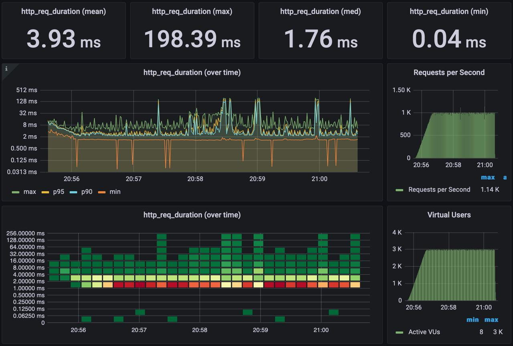

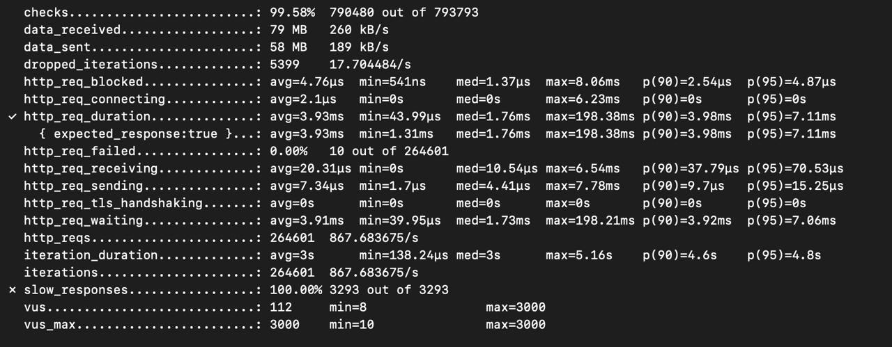

#### 2 инстанса - тестирование /auth

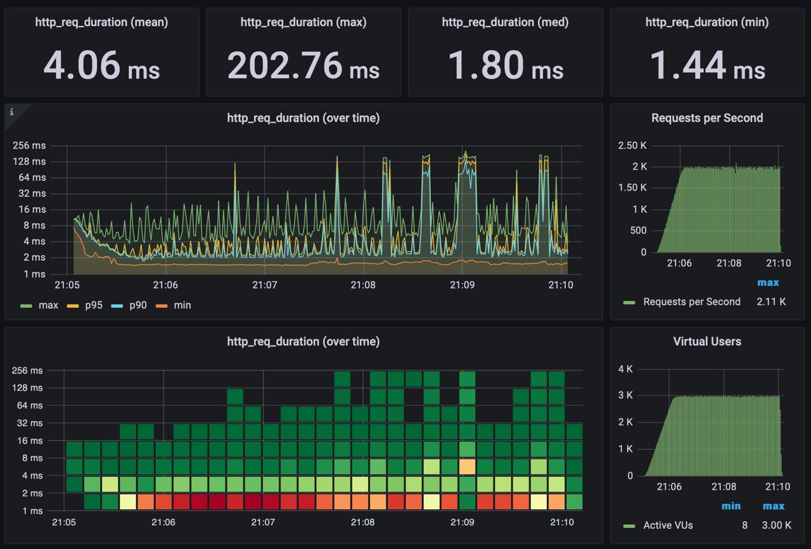

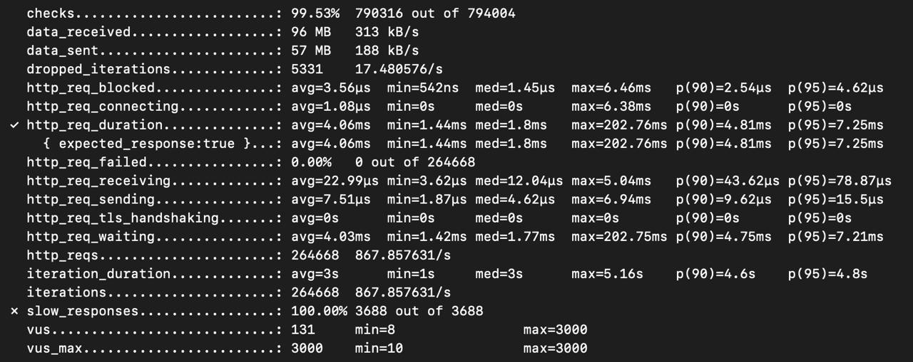

Количество ответов >50ms больше при балансировке, чем при одном экземпляре. А именно 3688 и 3293

Из результатов можно сделать вывод, что один инстанс более устойчив к нагрузкам

### Результаты на *chi*

#### 1 инстанс - тестирование /auth

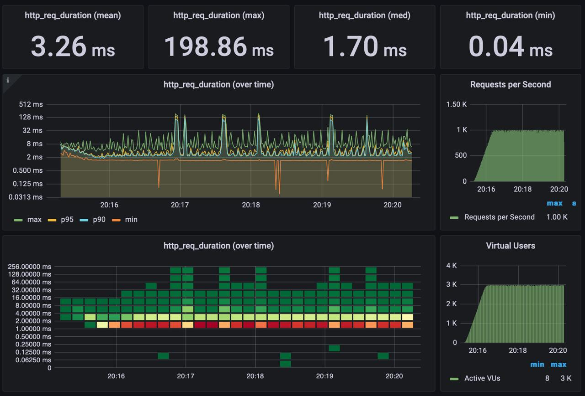

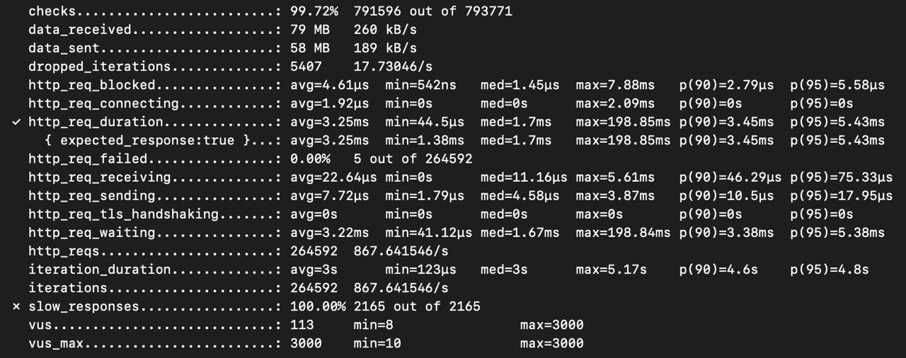

#### 2 инстанса - тестирование /auth

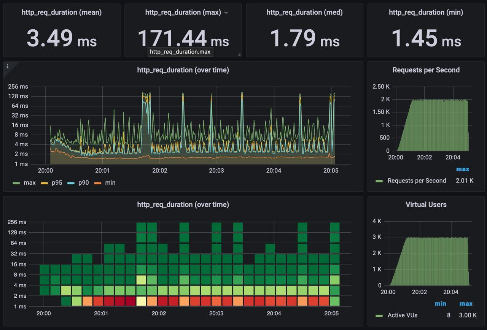

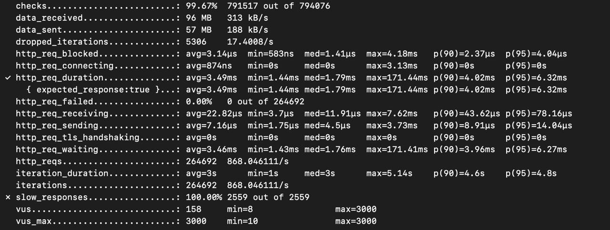

Количество ответов >50ms больше при балансировке, чем при одном экземпляре. А именно 2559 и 2165

Из результатов можно сделать вывод, что один инстанс более устойчив к нагрузкам

**Из результатов данного тестирования был сделан вывод, что разработку лучше вести на фреймворке сhi**

### Результаты тестирования остальных хендлеров

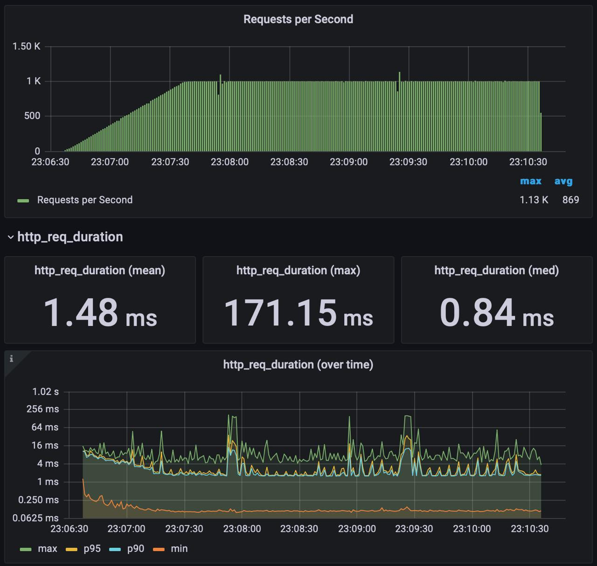

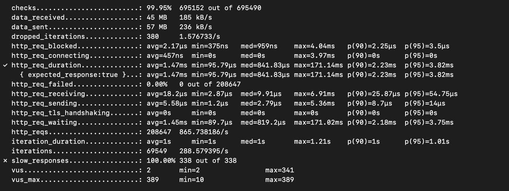

## ❓ Диллемы при разработке

Только на половине процесса разработки проекта пришла в голову мысль, что можно без id обойтись вовсе. А именно сделать *username* пользователя и *type* мерча первичными ключами. Правда из этого вытекали бы другие нюансы.

Сделал дополнительный атрибут с количеством купленного мерча в таблице *bought_merchs*

Необходимо делать транзакции при переводе монет и покупке мерча.

Как реализовать перевод монет?
Самым оптимальным вариантом, при котором модно отловить все ошибки, является использованием 4 транзакций: ищем получателя, снимаем деньги с отправителя, пополняем баланс получателя, записываем транзакцию. При покупке же снимаем ищем мерч, снимаем деньги, записываем в *bought_merchs*, обновляем количество покупок данного мерча

Сделать избыточность в таблице *bought_merchs* в виде атрибута *merch_name*, чтобы проще вытаскивать инвентарь или делать *join* с таблицей *merchs*? Сделал *join*. К слову, если бы PK было название мечра, то проблемы не было вовсе.

Также в некоторых методах доступа к данным хотел использоват *CTE*, но данная операция оказалась дорогостоющей по времени.

Обязательно храним пароли в хешированном виде.

Для нагрузочного тестирования пробовал такие инструменты как Apache Benchmark, Gatling, Locust и K6. Остановился на K6, тк можно явно задать RPS (у других такого не нашел)

При нагрузочном тестировании выявилось, хеширование паролей занимает львиную долю времени. В связи с этим, уменьшил так называемый *cost* - количество соли, которое добавляется при хешировании.

При нагрузочном тестировании хотел сделать реплику БД, но исключительно с *SELECT* работает только один хендлер, поэтому не стал делать.

Для выдерживания нагрузки увеличил количество максимальных подключений к БД до 1000.

Также в условии задачи было сказано, что максимальное количество пользователей - 100K. Пытался эмулировать при нагрузочных тестах, но машина оптимально выдерживала 3K.

При разработке компонента *storage* выяснилось, что транзакции к БД написаны без учета *дедлоков* при большом количестве пользователей.

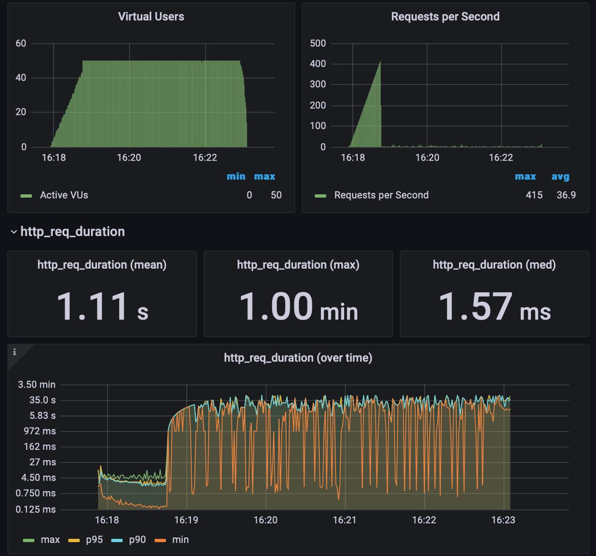

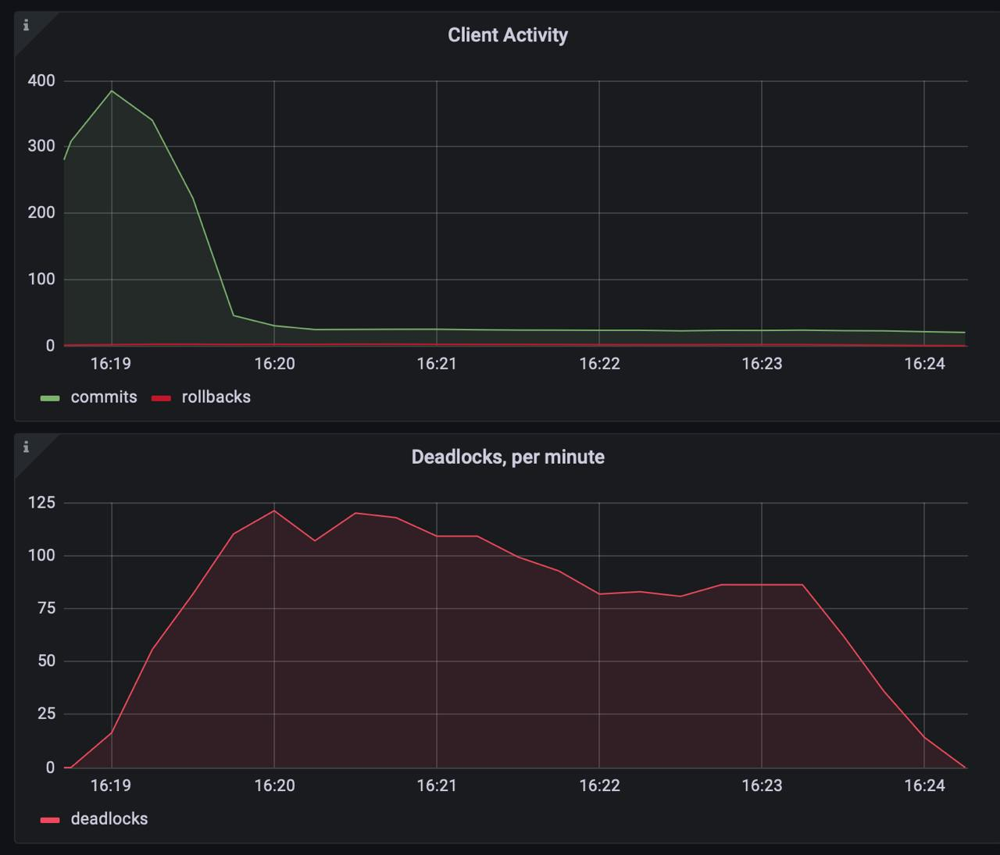

Решением было изменение запроса с использованием *SELECT FOR*
